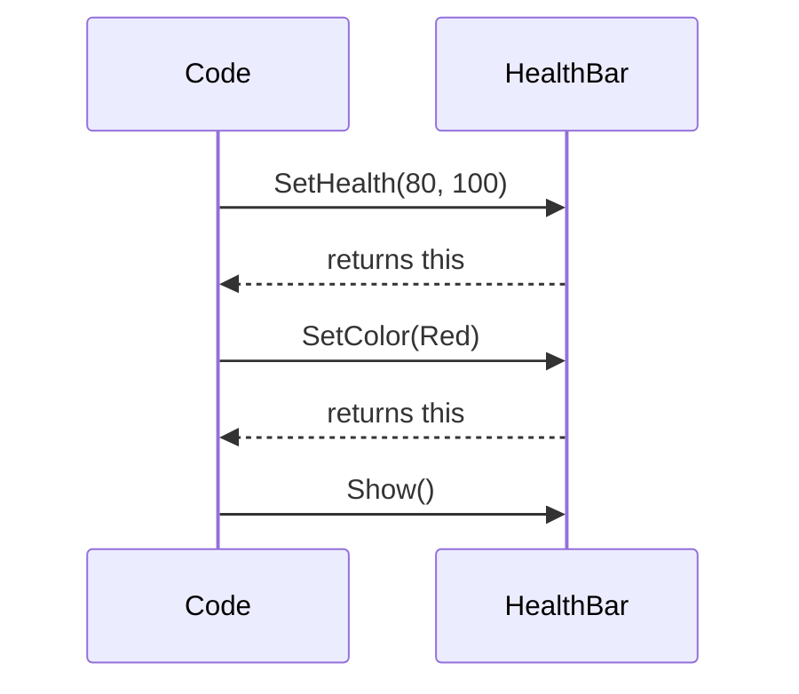
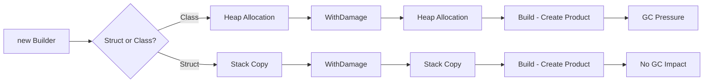
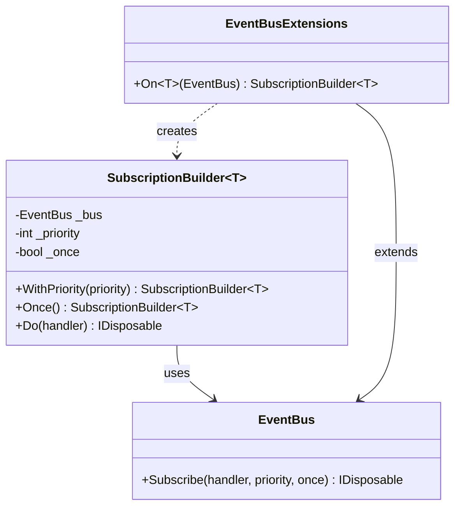
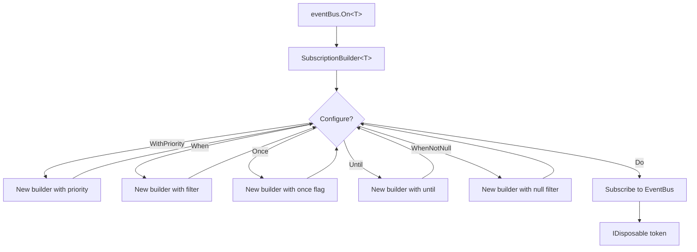

# Design Patterns - Fluent Builder Pattern in C#

## Table of Contents

1. [What is the Fluent Builder Pattern?](#1-what-is-the-fluent-builder-pattern)
2. [Method Chaining Basics](#2-method-chaining-basics)
3. [Simple Fluent Builder](#3-simple-fluent-builder)
4. [Immutable Builders](#4-immutable-builders)
5. [Value-Type Builders](#5-value-type-builders)
6. [Extension Methods for Fluent APIs](#6-extension-methods-for-fluent-apis)
7. [Complete Fluent Builder System](#7-complete-fluent-builder-system)
8. [Project Implementation Reference](#8-project-implementation-reference)
9. [Appexdix A: Common Pitfalls](#9-appendix-a-common-pitfalls)
   
---

## Learning Objectives

By the end of this lesson, students will be able to:

1. **Explain** the purpose and benefits of the Fluent Builder pattern
2. **Identify** the key characteristics that make an API "fluent"
3. **Implement** a basic fluent builder for method chaining
4. **Apply** immutability principles in fluent builder design
5. **Create** fluent builders using value-type structs for performance
6. **Extend** existing classes with fluent interfaces using extension methods

## Prerequisites

- Understanding of C# classes and methods
- Familiarity with method return types
- Basic understanding of immutability
- Knowledge of extension methods (covered in previous lessons)

---

## 1. What is the Fluent Builder Pattern?

### Definition

The **Fluent Builder pattern** is a design pattern that uses method chaining to create a readable, expressive API. Instead of multiple separate method calls or constructor parameters, operations flow together in a sentence-like structure.

### The Problem

Consider subscribing to an event with multiple configuration options:

```csharp
// Traditional approach - hard to read, easy to make mistakes
var subscription = eventBus.Subscribe<PlayerDiedEvent>(
    handler: OnPlayerDied,
    priority: -50,
    filter: evt => evt.Score > 1000,
    once: false
);

// What if I forget a parameter? What's the order again?
// Which parameters are optional?
```

### The Solution

A fluent builder makes the intent clear and reads like natural language:

```csharp
// Fluent approach - self-documenting and readable
var subscription = eventBus
    .On<PlayerDiedEvent>()
    .WithPriority(-50)
    .When(evt => evt.Score > 1000)
    .Do(OnPlayerDied);

// Clear, readable, self-documenting
// Only specify what you need
```

### Benefits

**Readability**: Code reads like English sentences
**Discoverability**: IntelliSense guides you through available options
**Type Safety**: Compile-time checking of valid combinations
**Optional Parameters**: Only specify what you need
**Validation**: Can enforce rules about valid configurations

### When to Use

**Good use cases**:
- Complex object construction with many parameters
- Configuration APIs where options are frequently combined
- Test setup code (test builders)
- Query building (LINQ-style APIs)
- Game object initialization

**Poor use cases**:
- Simple operations with 1-2 parameters
- Performance-critical hot paths
- When traditional syntax is clearer

---

## 2. Method Chaining Basics

### The Core Concept

Method chaining works by returning `this` from each method, allowing the next method to be called on the returned object.

```csharp
public class HealthBar
{
    private int _currentHealth;
    private int _maxHealth;
    private Color _color;
    
    // Each method returns 'this' for chaining
    public HealthBar SetHealth(int current, int max)
    {
        _currentHealth = current;
        _maxHealth = max;
        return this;
    }
    
    public HealthBar SetColor(Color color)
    {
        _color = color;
        return this;
    }
    
    public void Show()
    {
        Console.WriteLine($"Health: {_currentHealth}/{_maxHealth} [{_color}]");
    }
}

// Usage - chain methods together
var healthBar = new HealthBar();
healthBar
    .SetHealth(80, 100)
    .SetColor(Color.Red)
    .Show();
// Output: Health: 80/100 [Red]
```

### Why It Works



Each method returns the same object instance, allowing the next method call to operate on it.

### Simple Game Example

```csharp
public class Enemy
{
    private string _name;
    private int _health;
    private float _speed;
    
    public Enemy SetName(string name)
    {
        _name = name;
        return this;
    }
    
    public Enemy SetHealth(int health)
    {
        _health = health;
        return this;
    }
    
    public Enemy SetSpeed(float speed)
    {
        _speed = speed;
        return this;
    }
    
    public void Spawn(Vector3 position)
    {
        Console.WriteLine($"Spawning {_name} at {position}");
        Console.WriteLine($"Health: {_health}, Speed: {_speed}");
    }
}

// Usage
new Enemy()
    .SetName("Goblin")
    .SetHealth(50)
    .SetSpeed(3.5f)
    .Spawn(new Vector3(10, 0, 5));
```

### Problem with Basic Chaining

The basic approach modifies the object directly. This can cause issues:

```csharp
var enemyTemplate = new Enemy()
    .SetName("Goblin")
    .SetHealth(50);

// Later in code...
enemyTemplate
    .SetHealth(30)  // OOPS! Modified the template
    .Spawn(position);

// The template is now corrupted with Health = 30
```

---

## 3. Simple Fluent Builder

### Separating Builder from Product

A proper builder pattern creates the object only at the end, keeping the builder and product separate.

```csharp
// The product we want to create
public class Weapon
{
    public string Name { get; set; }
    public int Damage { get; set; }
    public float AttackSpeed { get; set; }
    public WeaponType Type { get; set; }
}

public enum WeaponType { Sword, Axe, Bow, Staff }

// The builder that constructs weapons
public class WeaponBuilder
{
    private string _name = "Unnamed Weapon";
    private int _damage = 10;
    private float _attackSpeed = 1.0f;
    private WeaponType _type = WeaponType.Sword;
    
    public WeaponBuilder WithName(string name)
    {
        _name = name;
        return this;
    }
    
    public WeaponBuilder WithDamage(int damage)
    {
        _damage = damage;
        return this;
    }
    
    public WeaponBuilder WithAttackSpeed(float speed)
    {
        _attackSpeed = speed;
        return this;
    }
    
    public WeaponBuilder WithType(WeaponType type)
    {
        _type = type;
        return this;
    }
    
    // Finalize and create the product
    public Weapon Build()
    {
        return new Weapon
        {
            Name = _name,
            Damage = _damage,
            AttackSpeed = _attackSpeed,
            Type = _type
        };
    }
}

// Usage
var sword = new WeaponBuilder()
    .WithName("Excalibur")
    .WithDamage(50)
    .WithAttackSpeed(1.5f)
    .WithType(WeaponType.Sword)
    .Build();

var bow = new WeaponBuilder()
    .WithName("Elven Bow")
    .WithDamage(30)
    .WithAttackSpeed(2.0f)
    .WithType(WeaponType.Bow)
    .Build();
```

### Builder with Validation

```csharp
public class WeaponBuilder
{
    private string _name = "Unnamed Weapon";
    private int _damage = 10;
    private float _attackSpeed = 1.0f;
    private WeaponType _type = WeaponType.Sword;
    
    public WeaponBuilder WithName(string name)
    {
        if (string.IsNullOrWhiteSpace(name))
            throw new ArgumentException("Weapon name cannot be empty");
            
        _name = name;
        return this;
    }
    
    public WeaponBuilder WithDamage(int damage)
    {
        if (damage < 0)
            throw new ArgumentException("Damage cannot be negative");
            
        _damage = damage;
        return this;
    }
    
    public WeaponBuilder WithAttackSpeed(float speed)
    {
        if (speed <= 0)
            throw new ArgumentException("Attack speed must be positive");
            
        _attackSpeed = speed;
        return this;
    }
    
    public WeaponBuilder WithType(WeaponType type)
    {
        _type = type;
        return this;
    }
    
    public Weapon Build()
    {
        // Final validation before building
        if (_type == WeaponType.Bow && _damage > 100)
            throw new InvalidOperationException("Bows cannot have damage > 100");
            
        return new Weapon
        {
            Name = _name,
            Damage = _damage,
            AttackSpeed = _attackSpeed,
            Type = _type
        };
    }
}
```

### Advantages

**Clear separation**: Builder configuration vs final product
**Validation**: Check parameters before creating object
**Reusability**: Can create multiple objects from same builder
**Defaults**: Provide sensible defaults for optional parameters

### Disadvantages

**Mutability**: Builder state can still be changed accidentally
**Memory**: Creates builder object before product object
**Confusion**: Can reuse builder, but state carries over

---

## 4. Immutable Builders

### The Problem with Mutable Builders

```csharp
var builder = new WeaponBuilder()
    .WithName("Sword")
    .WithDamage(50);

var sword1 = builder.Build();

// Reuse builder...
builder.WithDamage(100);  // Modified the builder!

var sword2 = builder.Build();  // Now has Damage = 100

// sword1 is fine, but this is confusing behavior
```

### Solution: Immutable Builder

Each method returns a NEW builder with the updated value.

```csharp
public class ImmutableWeaponBuilder
{
    private readonly string _name;
    private readonly int _damage;
    private readonly float _attackSpeed;
    private readonly WeaponType _type;
    
    // Constructor for defaults
    public ImmutableWeaponBuilder()
    {
        _name = "Unnamed Weapon";
        _damage = 10;
        _attackSpeed = 1.0f;
        _type = WeaponType.Sword;
    }
    
    // Private constructor for creating modified copies
    private ImmutableWeaponBuilder(string name, int damage, float attackSpeed, WeaponType type)
    {
        _name = name;
        _damage = damage;
        _attackSpeed = attackSpeed;
        _type = type;
    }
    
    // Each method returns a NEW builder
    public ImmutableWeaponBuilder WithName(string name)
    {
        return new ImmutableWeaponBuilder(name, _damage, _attackSpeed, _type);
    }
    
    public ImmutableWeaponBuilder WithDamage(int damage)
    {
        return new ImmutableWeaponBuilder(_name, damage, _attackSpeed, _type);
    }
    
    public ImmutableWeaponBuilder WithAttackSpeed(float speed)
    {
        return new ImmutableWeaponBuilder(_name, _damage, speed, _type);
    }
    
    public ImmutableWeaponBuilder WithType(WeaponType type)
    {
        return new ImmutableWeaponBuilder(_name, _damage, _attackSpeed, type);
    }
    
    public Weapon Build()
    {
        return new Weapon
        {
            Name = _name,
            Damage = _damage,
            AttackSpeed = _attackSpeed,
            Type = _type
        };
    }
}

// Usage - each step creates a new builder
var baseBuilder = new ImmutableWeaponBuilder()
    .WithName("Basic Sword");

var weakSword = baseBuilder
    .WithDamage(20)
    .Build();

var strongSword = baseBuilder
    .WithDamage(80)
    .Build();

// baseBuilder is unchanged - safe to reuse
```

### Advantages

**Safety**: Cannot accidentally modify shared builders
**Predictability**: Each chain is independent
**Thread-safe**: No shared mutable state

### Disadvantages

**Allocations**: Creates new builder object at each step
**Verbose**: More constructor parameters to maintain
**Performance**: More memory pressure from allocations

---

## 5. Value-Type Builders

### The Performance Solution

Use a `struct` instead of a `class` to avoid heap allocations until the final build.

```csharp
// Struct builder - lives on stack, no heap allocations
public readonly struct WeaponBuilderStruct
{
    private readonly string _name;
    private readonly int _damage;
    private readonly float _attackSpeed;
    private readonly WeaponType _type;
    
    public WeaponBuilderStruct()
    {
        _name = "Unnamed Weapon";
        _damage = 10;
        _attackSpeed = 1.0f;
        _type = WeaponType.Sword;
    }
    
    private WeaponBuilderStruct(string name, int damage, float attackSpeed, WeaponType type)
    {
        _name = name;
        _damage = damage;
        _attackSpeed = attackSpeed;
        _type = type;
    }
    
    public WeaponBuilderStruct WithName(string name)
    {
        return new WeaponBuilderStruct(name, _damage, _attackSpeed, _type);
    }
    
    public WeaponBuilderStruct WithDamage(int damage)
    {
        return new WeaponBuilderStruct(_name, damage, _attackSpeed, _type);
    }
    
    public WeaponBuilderStruct WithAttackSpeed(float speed)
    {
        return new WeaponBuilderStruct(_name, _damage, speed, _type);
    }
    
    public WeaponBuilderStruct WithType(WeaponType type)
    {
        return new WeaponBuilderStruct(_name, _damage, _attackSpeed, type);
    }
    
    public Weapon Build()
    {
        return new Weapon
        {
            Name = _name,
            Damage = _damage,
            AttackSpeed = _attackSpeed,
            Type = _type
        };
    }
}

// Usage - identical syntax, but no heap allocations until Build()
var weapon = new WeaponBuilderStruct()
    .WithName("Legendary Axe")
    .WithDamage(90)
    .WithType(WeaponType.Axe)
    .Build();
```

### Struct vs Class Performance



### Comparison Table

| Aspect | Class Builder | Struct Builder |
|--------|---------------|----------------|
| Memory | Heap allocated | Stack allocated |
| GC Pressure | High (multiple objects) | Low (stack only) |
| Copying | Reference copy | Value copy |
| Performance | Slower | Faster |
| Null Safety | Can be null | Cannot be null |
| Inheritance | Supports | Limited |

### When to Use Struct Builders

**Use structs when**:
- Builder is short-lived (method scope)
- Builder has few fields (< 16 bytes recommended)
- Performance matters
- No inheritance needed

**Use classes when**:
- Builder is long-lived
- Many fields or complex state
- Need inheritance or polymorphism
- Builder itself is the product

---

## 6. Extension Methods for Fluent APIs

### Extending Existing Classes

You can add fluent methods to existing classes without modifying them using extension methods.

```csharp
// Existing class we cannot modify
public class EventBus
{
    public IDisposable Subscribe<T>(Action<T> handler, int priority = 0, bool once = false)
    {
        // Implementation...
        return null; // Placeholder
    }
}

// Extension methods to add fluent API
public static class EventBusExtensions
{
    // Start the fluent chain
    public static SubscriptionBuilder<T> On<T>(this EventBus bus)
    {
        return new SubscriptionBuilder<T>(bus);
    }
}

// The builder that provides the fluent interface
public readonly struct SubscriptionBuilder<T>
{
    private readonly EventBus _bus;
    private readonly int _priority;
    private readonly bool _once;
    
    public SubscriptionBuilder(EventBus bus)
    {
        _bus = bus;
        _priority = 0;
        _once = false;
    }
    
    private SubscriptionBuilder(EventBus bus, int priority, bool once)
    {
        _bus = bus;
        _priority = priority;
        _once = once;
    }
    
    public SubscriptionBuilder<T> WithPriority(int priority)
    {
        return new SubscriptionBuilder<T>(_bus, priority, _once);
    }
    
    public SubscriptionBuilder<T> Once()
    {
        return new SubscriptionBuilder<T>(_bus, _priority, true);
    }
    
    // Finalize - calls the original Subscribe method
    public IDisposable Do(Action<T> handler)
    {
        return _bus.Subscribe(handler, _priority, _once);
    }
}

// Usage - fluent API on existing class!
var eventBus = new EventBus();

var subscription = eventBus
    .On<PlayerDiedEvent>()
    .WithPriority(-50)
    .Once()
    .Do(evt => Console.WriteLine("Player died!"));
```

### Pattern Visualization



### Real-World Example: Query Builder

```csharp
// Existing data service
public class DataService
{
    public List<Enemy> GetEnemies(string type, int minLevel, int maxLevel, bool alive)
    {
        // Implementation...
        return new List<Enemy>();
    }
}

// Fluent extension
public static class DataServiceExtensions
{
    public static EnemyQuery Enemies(this DataService service)
    {
        return new EnemyQuery(service);
    }
}

public readonly struct EnemyQuery
{
    private readonly DataService _service;
    private readonly string _type;
    private readonly int _minLevel;
    private readonly int _maxLevel;
    private readonly bool _aliveOnly;
    
    public EnemyQuery(DataService service)
    {
        _service = service;
        _type = null;
        _minLevel = 0;
        _maxLevel = int.MaxValue;
        _aliveOnly = false;
    }
    
    private EnemyQuery(DataService service, string type, int minLevel, int maxLevel, bool aliveOnly)
    {
        _service = service;
        _type = type;
        _minLevel = minLevel;
        _maxLevel = maxLevel;
        _aliveOnly = aliveOnly;
    }
    
    public EnemyQuery OfType(string type)
    {
        return new EnemyQuery(_service, type, _minLevel, _maxLevel, _aliveOnly);
    }
    
    public EnemyQuery WithMinLevel(int level)
    {
        return new EnemyQuery(_service, _type, level, _maxLevel, _aliveOnly);
    }
    
    public EnemyQuery WithMaxLevel(int level)
    {
        return new EnemyQuery(_service, _type, _minLevel, level, _aliveOnly);
    }
    
    public EnemyQuery AliveOnly()
    {
        return new EnemyQuery(_service, _type, _minLevel, _maxLevel, true);
    }
    
    public List<Enemy> Execute()
    {
        return _service.GetEnemies(_type, _minLevel, _maxLevel, _aliveOnly);
    }
}

// Usage - LINQ-style querying
var dataService = new DataService();

var enemies = dataService
    .Enemies()
    .OfType("Goblin")
    .WithMinLevel(5)
    .WithMaxLevel(10)
    .AliveOnly()
    .Execute();
```

---

## 7. Complete Fluent Builder System

Let's build a complete, production-ready fluent builder for event subscriptions.

### Requirements

- Support priority-based execution
- Filter events with predicates
- One-shot subscriptions
- Until condition (auto-unsubscribe)
- Null-checking conveniences
- Value-type for performance

### Complete Implementation

```csharp
// Event bus (simplified for example)
public class EventBus
{
    public IDisposable Subscribe<T>(Action<T> handler, int priority, Predicate<T> filter, bool once)
    {
        // Implementation details...
        return null; // Placeholder
    }
}

// Extension method to start fluent chain
public static class EventBusFluentExtensions
{
    public static SubscriptionBuilder<T> On<T>(this EventBus bus)
    {
        return new SubscriptionBuilder<T>(bus);
    }
}

// Priority constants for readability
public static class EventPriority
{
    public const int Critical = -100;
    public const int High = -50;
    public const int Normal = 0;
    public const int Low = 50;
    public const int VeryLow = 100;
}

// The fluent builder
public readonly struct SubscriptionBuilder<T>
{
    private readonly EventBus _bus;
    private readonly int _priority;
    private readonly Predicate<T> _filter;
    private readonly bool _once;
    private readonly Predicate<T> _until;
    
    // Public constructor - starting point
    public SubscriptionBuilder(EventBus bus)
    {
        if (bus == null)
            throw new ArgumentNullException(nameof(bus));
            
        _bus = bus;
        _priority = 0;
        _filter = null;
        _once = false;
        _until = null;
    }
    
    // Private constructor - for creating modified copies
    private SubscriptionBuilder(EventBus bus, int priority, Predicate<T> filter, bool once, Predicate<T> until)
    {
        _bus = bus;
        _priority = priority;
        _filter = filter;
        _once = once;
        _until = until;
    }
    
    // Set explicit priority value
    public SubscriptionBuilder<T> WithPriority(int priority)
    {
        return new SubscriptionBuilder<T>(_bus, priority, _filter, _once, _until);
    }
    
    // Use named priority constant
    public SubscriptionBuilder<T> WithPriorityPreset(int preset)
    {
        return WithPriority(preset);
    }
    
    // Filter events with predicate
    public SubscriptionBuilder<T> When(Predicate<T> predicate)
    {
        if (predicate == null)
            throw new ArgumentNullException(nameof(predicate));
            
        return new SubscriptionBuilder<T>(_bus, _priority, predicate, _once, _until);
    }
    
    // Convenience filter for null checking
    public SubscriptionBuilder<T> WhenNotNull<U>(Func<T, U> selector) where U : class
    {
        if (selector == null)
            throw new ArgumentNullException(nameof(selector));
            
        return When(evt => selector(evt) != null);
    }
    
    // One-shot subscription
    public SubscriptionBuilder<T> Once()
    {
        return new SubscriptionBuilder<T>(_bus, _priority, _filter, true, _until);
    }
    
    // Auto-unsubscribe when condition becomes true
    public SubscriptionBuilder<T> Until(Predicate<T> predicate)
    {
        if (predicate == null)
            throw new ArgumentNullException(nameof(predicate));
            
        return new SubscriptionBuilder<T>(_bus, _priority, _filter, _once, predicate);
    }
    
    // Finalize and create subscription
    public IDisposable Do(Action<T> handler)
    {
        if (handler == null)
            throw new ArgumentNullException(nameof(handler));
        
        // If we have an 'until' condition, wrap the handler
        Action<T> finalHandler = handler;
        IDisposable token = null;
        
        if (_until != null)
        {
            finalHandler = (evt) =>
            {
                handler(evt);
                if (_until(evt))
                    token?.Dispose();
            };
        }
        
        token = _bus.Subscribe(finalHandler, _priority, _filter, _once);
        return token;
    }
}
```

### Usage Examples

```csharp
var eventBus = new EventBus();

// Example 1: Simple subscription
var sub1 = eventBus
    .On<PlayerDiedEvent>()
    .Do(evt => Console.WriteLine("Player died"));

// Example 2: Priority and filtering
var sub2 = eventBus
    .On<ScoreChangedEvent>()
    .WithPriorityPreset(EventPriority.High)
    .When(evt => evt.NewScore > evt.OldScore)
    .Do(evt => Console.WriteLine($"Score increased by {evt.NewScore - evt.OldScore}"));

// Example 3: One-shot subscription
var sub3 = eventBus
    .On<GameStartEvent>()
    .Once()
    .Do(evt => Console.WriteLine("Game started for the first time"));

// Example 4: Complex subscription with multiple filters
var sub4 = eventBus
    .On<ItemCollectedEvent>()
    .WithPriority(-20)
    .When(evt => evt.ItemType == ItemType.Weapon)
    .WhenNotNull(evt => evt.Metadata)
    .Do(evt => Console.WriteLine($"Collected weapon: {evt.ItemName}"));

// Example 5: Until condition
int deathCount = 0;
var sub5 = eventBus
    .On<PlayerDiedEvent>()
    .Until(evt => ++deathCount >= 3)
    .Do(evt => Console.WriteLine($"Death #{deathCount}"));
// Automatically unsubscribes after 3 deaths

// Example 6: Combining everything
var sub6 = eventBus
    .On<EnemyDefeatedEvent>()
    .WithPriorityPreset(EventPriority.Normal)
    .When(evt => evt.EnemyLevel >= 10)
    .WhenNotNull(evt => evt.LootTable)
    .Do(evt => 
    {
        Console.WriteLine($"Defeated high-level enemy: {evt.EnemyName}");
        AwardExperience(evt.ExperiencePoints);
        DropLoot(evt.LootTable);
    });
```

### Flow Diagram



---

## 8. Project Implementation Reference

The project contains a production-ready implementation of the fluent builder pattern for event subscriptions.

### Project Files

**EventBus.cs** (lines 297-411) contains the complete fluent API implementation:

- `EventBusFluent` static class with extension methods
- `SubscriptionBuilder<T>` readonly struct for chaining
- Support for priority, filtering, once, and until conditions

### Key Features in Project Implementation

**Value-Type Builder**:
```csharp
public readonly struct SubscriptionBuilder<T>
{
    // Uses struct to avoid heap allocations
    // All fields are readonly for immutability
}
```

**Extension Method Pattern**:
```csharp
public static SubscriptionBuilder<T> On<T>(this EventBus bus)
{
    return new SubscriptionBuilder<T>(bus);
}
```

**Method Chaining**:
Each configuration method returns a new `SubscriptionBuilder<T>` with updated state:
- `WithPriority(int priority)`
- `WithPriorityPreset(int preset)`
- `When(Predicate<T> predicate)`
- `WhenNotNull<U>(Func<T, U> selector)`
- `Once()`
- `Until(Predicate<T> predicate)`

**Finalization**:
The `Do(Action<T> handler)` method creates the actual subscription and returns `IDisposable`.

### Differences from Tutorial Version

| Feature | Tutorial | Project |
|---------|----------|---------|
| Thread Safety | Not covered | Uses locks in EventBus |
| Error Handling | Basic | Try-catch in dispatch |
| Queuing | Direct dispatch | Queued with DispatchAll |
| Frame Integration | Not shown | EventSystem integration |
| Documentation | Learning-focused | Production XML comments |

### Integration Example

```csharp
// From the project - how it's used in a real game system
public class CombatSystem
{
    private EventBus _eventBus;
    private List<IDisposable> _subscriptions;
    
    public void Initialize(EventBus eventBus)
    {
        _eventBus = eventBus;
        _subscriptions = new List<IDisposable>();
        
        // Subscribe with fluent API
        _subscriptions.Add(
            _eventBus
                .On<AttackEvent>()
                .WithPriorityPreset(EventPriority.Systems)
                .When(evt => evt.Target.IsAlive)
                .Do(ProcessAttack)
        );
        
        _subscriptions.Add(
            _eventBus
                .On<DamageEvent>()
                .WithPriorityPreset(EventPriority.Systems)
                .Do(ApplyDamage)
        );
    }
    
    public void Cleanup()
    {
        foreach (var sub in _subscriptions)
            sub.Dispose();
            
        _subscriptions.Clear();
    }
    
    private void ProcessAttack(AttackEvent evt) { /* ... */ }
    private void ApplyDamage(DamageEvent evt) { /* ... */ }
}
```

---

## Summary and Best Practices

### Key Takeaways

**Fluent builders create readable, self-documenting code** through method chaining that reads like natural language.

**Immutability prevents bugs** by ensuring each step in the chain cannot accidentally modify previous state.

**Value-type builders optimize performance** by avoiding heap allocations until the final build step.

**Extension methods add fluent APIs** to existing classes without modifying their source code.

**Finalization methods** (like `Build()` or `Do()`) separate configuration from execution.

### When to Use Fluent Builders

**Use when**:
- Object construction has many optional parameters
- Configuration steps are frequently combined
- Code readability would benefit from natural language flow
- IntelliSense discovery would help users
- You need to validate complex combinations of parameters

**Avoid when**:
- Simple operations with 1-2 required parameters
- Performance is critical and allocations matter (unless using struct)
- Traditional syntax is already clear and simple
- The API is rarely used

### Design Principles

**Start simple**: Begin with `this`-returning methods
**Make immutable**: Return new instances instead of modifying state
**Use structs**: Prefer value types for short-lived builders
**Provide defaults**: Sensible defaults for all optional parameters
**Validate early**: Check parameters in builder methods, not just Build()
**Finalize explicitly**: Clear method name like `Build()`, `Execute()`, or `Do()`

---

## 9. Appendix A: Common Pitfalls

### Pitfall 1: Null Reference in Chain

```csharp
// BAD: No null checking
public static SubscriptionBuilder<T> On<T>(this EventBus bus)
{
    return new SubscriptionBuilder<T>(bus);  // What if bus is null?
}

// GOOD: Validate immediately
public static SubscriptionBuilder<T> On<T>(this EventBus bus)
{
    if (bus == null)
        throw new ArgumentNullException(nameof(bus));
        
    return new SubscriptionBuilder<T>(bus);
}
```

### Pitfall 2: Side Effects in Builder Methods

```csharp
// BAD: Builder method has side effects
public WeaponBuilder WithDamage(int damage)
{
    _damage = damage;
    Logger.Log($"Damage set to {damage}");  // Side effect!
    return this;
}

// GOOD: Builders should be pure configuration
public WeaponBuilder WithDamage(int damage)
{
    return new WeaponBuilder(_name, damage, _attackSpeed, _type);
}
```

### Pitfall 3: Forgetting Readonly on Struct Fields

```csharp
// BAD: Mutable struct fields cause confusion
public struct Builder
{
    private int _value;  // Not readonly!
    
    public Builder WithValue(int value)
    {
        _value = value;  // Modifies local copy in stack
        return this;     // Returns modified copy
    }
}

// GOOD: Readonly struct with proper immutability
public readonly struct Builder
{
    private readonly int _value;
    
    public Builder WithValue(int value)
    {
        return new Builder(value);
    }
}
```

### Pitfall 4: Large Struct Builders

```csharp
// BAD: Struct with many fields causes excessive copying
public readonly struct HugeBuilder
{
    private readonly string _field1;
    private readonly string _field2;
    // ... 20 more fields
    private readonly string _field22;
    
    // Each method call copies all 22 fields!
}

// GOOD: Use class for builders with many fields
public class LargeBuilder
{
    // Reference copy is cheaper for large state
}
```

### Pitfall 5: Confusing Method Names

```csharp
// BAD: Unclear finalization
public Weapon Get() { }
public Weapon Create() { }
public Weapon Make() { }

// GOOD: Clear, conventional names
public Weapon Build() { }      // For builders
public void Execute() { }      // For commands
public IDisposable Do() { }    // For subscriptions
```

