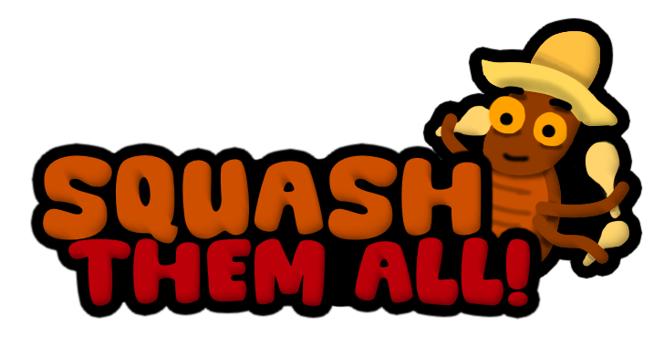

# 3DGED — Squash Them All!

|                                                                |     |                                                                            |
| -------------------------------------------------------------- | --- | -------------------------------------------------------------------------- |
|  | BY  |  |

Game Engine on MonoGame

## 🔍 About The Game

Squash Them All is a game where a child (you) has been left home alone for a good while as your parents are away on holidays. You ignored the chores and didn't take care of the house. Now you face your greatest fear. ROACHES! Your actions had consequences and it's time for you to clean it up. Squash them all before they fully infest your whole house. You have 2 minutes so make it count!

## 🔗 Screencast link

youtube link here

## 🎮 Controls

| Keys           | -   | Action            |
| -------------- | --- | ----------------- |
| **WASD**       | -   | Movement          |
| **E**          | -   | Pickup            |
| **LEFT CLICK** | -   | Hit / UI Clicking |
| **MOUSE**      | -   | Camera Movement   |
| **F5**         | -   | Full Screen       |
| **SPACE**      | -   | Leave Cutscene    |

## ⚙️ Settings

| Settings         | -   | Action                                                                 |
| ---------------- | --- | ---------------------------------------------------------------------- |
| **Music Slider** | -   | Allows you to re-adjust the volume of the music within the game        |
| **SFX Slider**   | -   | Allows you to readjust the volume of the sound effects within the game |

## ⚠️ Known Issues

- Spatula layering makes it disappear sometimes.
- Roaches don't turn the way they are moving.
- Everything can walk through walls.
- Roaches sometimes tend to flip over on their side or upside down, some tend to fly up a bit.
- Invisible textures on models.
- Roaches tend to just clip through the ground and fall. (We increased the amount of roaches to still have enough roaches for the player to squash)
- No collision on the map.
- Player can phase through objects.
- Play again button doesn't actually reload the game.

## 👥 Contributions

| Person         | -   | Contributions                                                      |
| -------------- | --- | ------------------------------------------------------------------ |
| **Gabrielius** | -   | Version control                                                    |
|                | -   | Updating project to the newest engine code                         |
|                | -   | Merging members code to main and fix merge conflicts               |
|                | -   | Fixing bugs (UI image not showing up for controls) & making tweaks |
|                | -   | Fixed up the dialogue showing up and text displayed                |
|                | -   | Roach spawning                                                     |
|                | -   | Made the README.md file                                            |
|                | -   | Made the screencast                                                |
| ###            | -   | ###                                                                |
| **Aleksei**    | -   | Created game mechanics (squashing roach)                           |
|                | -   | Programmed audio inside of the game                                |
|                | -   | Made the slider for the individual sound volumes                   |
|                | -   | Did the curve controller & camera switch from cutscene to gameplay |
|                | -   | Fixed issues (can kill roaches from any range)                     |
|                | -   | Made the spatula rotation                                          |
|                | -   | Picking up spatula                                                 |
|                | -   | Roach Movement                                                     |
|                | -   | Score system                                                       |
| ###            | -   | ###                                                                |
| **Mykola**     | -   | Made & Uploaded 3D Models & textures                               |
|                | -   | Updated manifest                                                   |
|                | -   | Updated json spawning                                              |
|                | -   | Developed sounds & music                                           |
| ###            | -   | ###                                                                |
| **Mykhailo**   | -   | Added timer UI                                                     |
|                | -   | Added roach counter                                                |
|                | -   | Added task UI                                                      |
|                | -   | Added dialogue system                                              |
|                | -   | Uploaded UI components                                             |
|                | -   | Trigger-able colliders                                             |
|                | -   | Created Main Menu, Control Menu, Pause, Win/Lose Menu              |
| ###            | -   | ###                                                                |

## 📖 Third Party Assets

The background image for the menu was generated by ChatGPT using the prompt "can you create an image for a background which will have cartoony house and bright colours" on the 5 December 2025.

Flaticon. (2019). Cockroach Icon - 1553871 [online]. Flaticon [online]. Available from: https://www.flaticon.com/free-icon/cockroach_1553871 [accessed 10 November 2025].

pagancow. (2006). dorm door opening.wav [online]. Freesound [online]. Available from: https://freesound.org/people/pagancow/sounds/15419/ [accessed 9 November 2025].

### 🏗️ Tools

| Tool      | -   | Why                    |
| --------- | --- | ---------------------- |
| Figma     | -   | UI Development         |
| Paint.net | -   | Creating visual assets |
| Reaper    | -   | Sound editing          |
| Blender   | -   | 3D modelling           |
