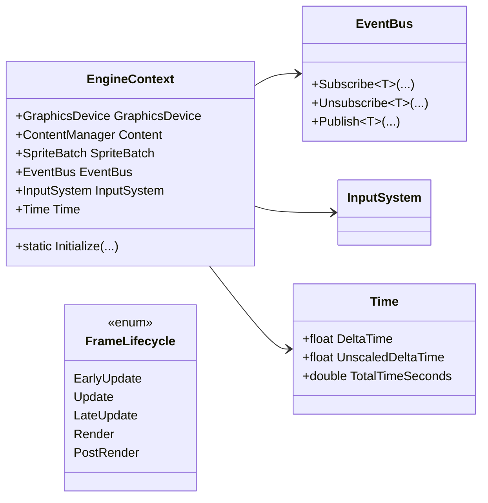
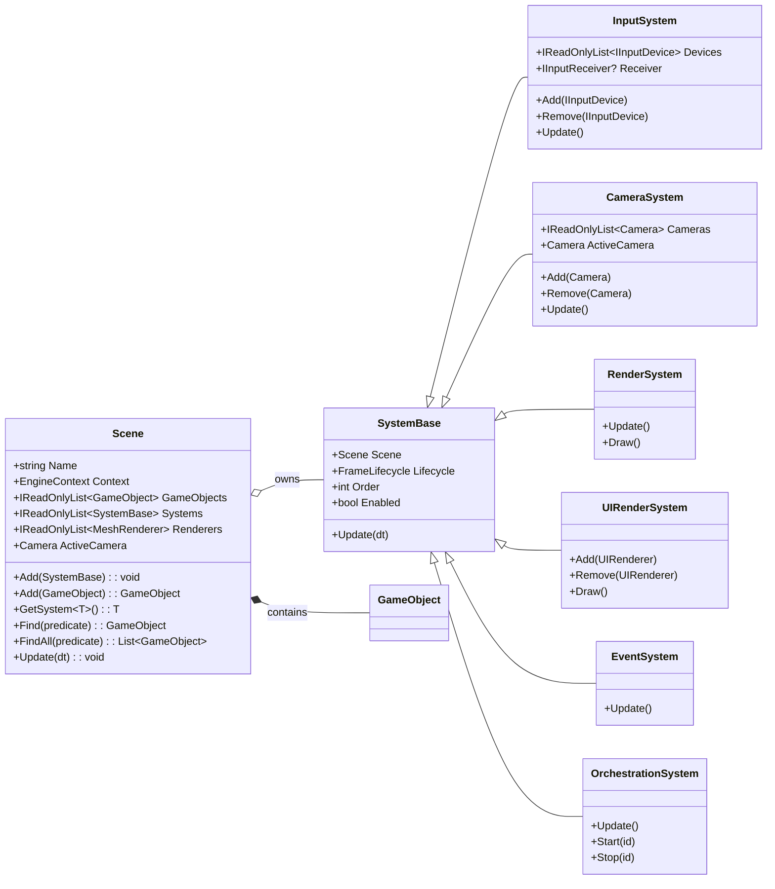
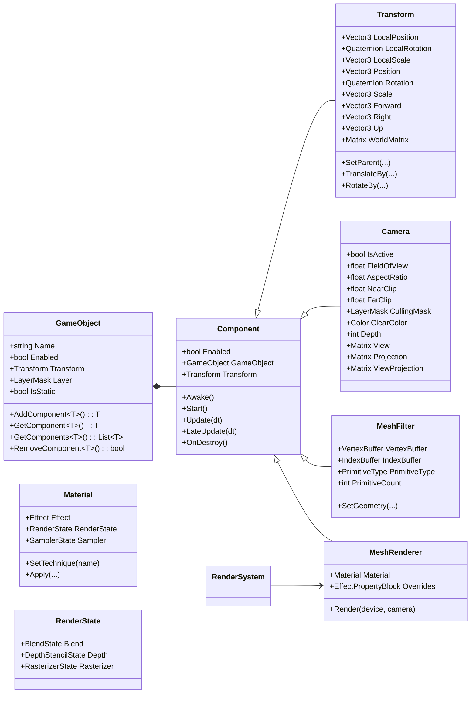
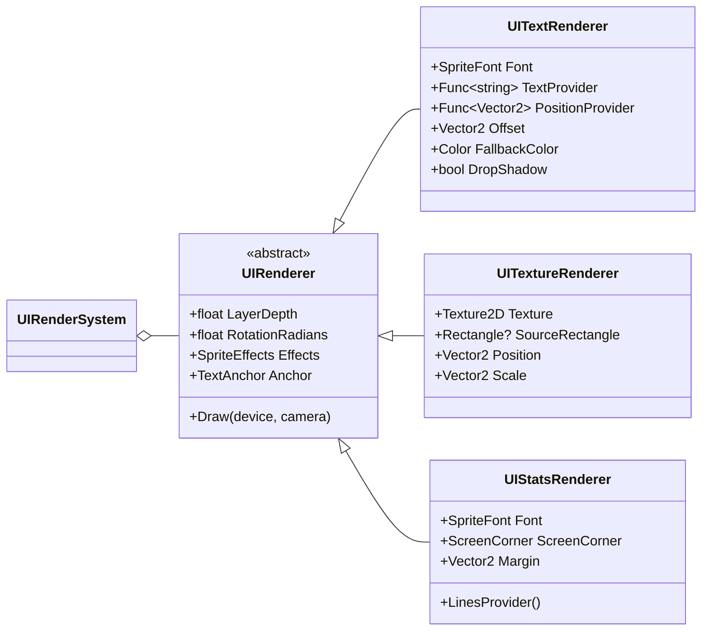
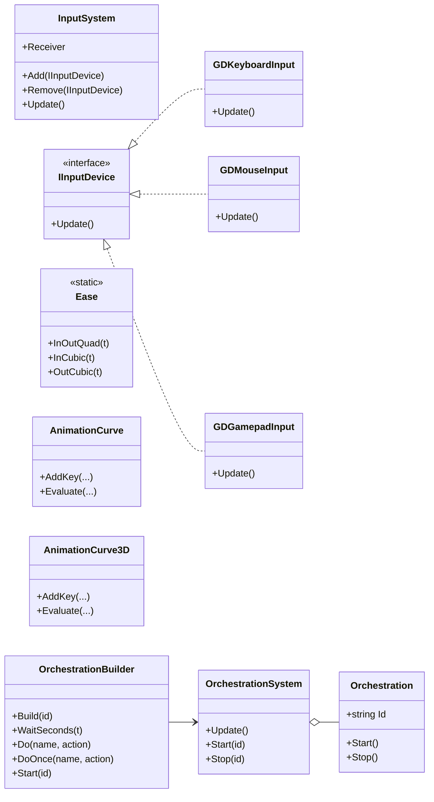

# 3DGED — Unity-Modeled ECS Engine on MonoGame

## Table of Contents

- [1. Overview](#1-overview)
- [2. Module Notes](#2-module-notes)
- [3. Required Reading](#3-required-reading)
- [4. Recommended Reading](#4-recommended-reading)
- [5. Lab Exercises](#5-lab-exercises)
- [6. Project Folder Structure](#6-project-folder-structure)
- [7. Design Prompts](#7-design-prompts)
- [8. Class Diagrams](#8-class-diagrams)
  - [Core Context & Services](#core-context--services)
  - [Scene & Systems](#scene--systems)
  - [Entities & Rendering](#entities--rendering)
  - [UI & Overlays](#ui--overlays)
  - [Input, Animation Curves & Orchestration](#input-animation-curves--orchestration)
- [9. Design Objectives](#9-design-objectives)
- [10. Useful Links](#10-useful-links)
- [11. To Do](#11-to-do)

## 1. Overview
This repository contains a minimal-but-structured 3D engine scaffold for MonoGame. It adopts Unity-style names and lifecycles so students can transfer knowledge directly: `Scene`, `GameObject`, `Component`, `Transform`, `Camera`, `MeshFilter`, `MeshRenderer`, `SystemBase`, `RenderingSystem`, `InputSystem`, etc. 

It is designed for **incremental classroom live-coding** and emphasizes clear separation of **data (components)** from **behavior (systems)**.

## 2. Module Notes 

- [Understanding PrimitiveType](Notes/Notes%20-%20Understanding%20Primitives.md)
- [Understanding Effect](Notes/Notes%20-%20Understanding%20Effects.md)
- [Understanding JSON Serialization](Notes/Notes%20-%20Understanding%20JSON%20Serialization.md)
- [Design Patterns - Observer & Event Systems in C#](/Notes/Notes%20-%20Design%20Patterns%20-%20Observer.md)
- [Design Patterns - Fluent Builder Pattern in C#](/Notes/Notes%20-%20Design%20Patterns%20-%20Fluent%20Builder.md)
  
## 3. Required Reading 
 
- [Drawing 3D Primitives using Lists or Strips](https://docs.monogame.net/articles/getting_to_know/howto/graphics/HowTo_Draw_3D_Primitives.html#:~:text=Overview,basic%20effect%20and%20transformation%20matrices.)
- [Quick Understanding of Homogeneous Coordinates for Computer Graphics](https://www.youtube.com/watch?v=o-xwmTODTUI)
- [Article - World, View and Projection Transformation Matrices](http://www.codinglabs.net/article_world_view_projection_matrix.aspx)

## 4. Recommended Reading 

- [Computer Graphics | The MVP Matrix (Model-View-Projection) in 3D Rendering](https://www.youtube.com/watch?v=a_rX4xfYcy4)
- [MonoGame Documentation - Graphics and Shaders](https://docs.monogame.net/articles/getting_started/5_adding_basic_code.html)
- [DirectX Documentation - Primitive Topologies](https://docs.microsoft.com/en-us/windows/win32/direct3d11/d3d10-graphics-programming-guide-primitive-topologies)
- [OpenGL Tutorial - Drawing Primitives](https://www.khronos.org/opengl/wiki/Primitive)

## 5. Lab Exercises
- [Systems: Adding PerfStatsSystem](Labs/Lab%20-%20PerfStats.md)
- [Serialization: Loading models with JSON](Labs/Lab%20-%20JSON%20Serialization.md)
- [UI: Adding reticle and text renderers](Labs/Lab%20-%20UI%20Renderer%20-%20Reticle%20and%20Text.md)

## 6. Project Folder Structure
```
/Engine
  /Core
    /Entities
      Scene.cs                  (Scene management, GameObject lifecycle)
      GameObject.cs             (Entity with components)
    /Components
      Component.cs              (Base component class)
      Transform.cs              (Position, rotation, scale, hierarchy)
      Camera.cs                 (View/Projection, culling, viewport)
      MeshFilter.cs             (Vertex/Index buffers, geometry data)
      MeshRenderer.cs           (Material, rendering state)
    /Systems
      SystemBase.cs             (Base system class with lifecycle)
      RenderSystem.cs           (3D mesh rendering)
      CameraSystem.cs           (Camera management, view frustum)
      InputSystem.cs            (Input device coordination)
      EventSystem.cs            (Event dispatching)
      OrchestrationSystem.cs    (Scene orchestration coordination)
      UIRenderSystem.cs         (UI rendering pipeline)
    /Services
      EngineContext.cs          (GraphicsDevice, Content, SpriteBatch)
      FrameLifecycle.cs         (Update/Render phase enumeration)
      EventBus.cs               (Global event messaging)
  /Rendering
    /Materials
      Material.cs               (Effect, render state, samplers)
      EffectPropertyBlock.cs    (Per-instance shader parameters)
      RenderState.cs            (Blend, depth, raster states)
    /Effects
      IEffectBinder.cs          (Effect parameter binding interface)
      EffectBinderRegistry.cs   (Effect binder factory)
      BasicEffectBinder.cs      (BasicEffect parameter binding)
      AlphaTestEffectBinder.cs  (AlphaTestEffect binding)
      DualTextureEffectBinder.cs (DualTextureEffect binding)
      EnvironmentMapEffectBinder.cs (EnvironmentMapEffect binding)
      DefaultParamBinder.cs     (Default parameter binding)
    /Geometry
      MeshFilterFactory.cs      (Procedural geometry generation)
    /Culling
      LayerMask.cs              (Layer-based visibility)
      Octree.cs                 (Spatial partitioning)
  /UI
    UIRenderer.cs               (Base UI rendering)
    UITextRenderer.cs           (Text rendering)
    UITextureRenderer.cs        (Texture/sprite rendering)
    UIStatsRenderer.cs          (Performance statistics display)
  /Input
    /Devices
      GDKeyboardInput.cs        (Keyboard input device)
      GDGamepadInput.cs         (Gamepad input device)
      GDMouseInput.cs           (Mouse input device)
    /Interfaces
      IInputDevice.cs           (Input device interface)
      IInputReceiver.cs         (Input consumer interface)
      IDraw.cs                  (Drawable interface)
    /Bindings
      InputAction.cs            (Input action enumeration)
      InputBindings.cs          (Action to key/button mapping)
  /Timing
    Time.cs                     (Delta time, total time)
    Ease.cs                     (Easing functions)
    AnimationCurve.cs           (Keyframe-based curves)
  /Utilities
    /Math
      Vector3Extensions.cs      (Vector3 helper methods)
      Integer2.cs               (2D integer vector)
    /Window
      WindowUtility.cs          (Window management helpers)
      ScreenResolution.cs       (Resolution management)
    /Serialization
      JSONSerializationUtility.cs (JSON save/load)
      Vector3JsonConverter.cs   (Vector3 JSON conversion)
      AssetManifest.cs          (Asset loading manifest)
      ModelSpawnData.cs         (Model instantiation data)
  /Collections
    IndexedCollection.cs        (Fast lookup collection)
    CircularBuffer.cs           (Ring buffer)
    ContentDictionary.cs        (Content-keyed dictionary)
    NamedDictionary.cs          (Name-keyed dictionary)
    ObjectPool.cs               (Object pooling)
  /Orchestration
    Orchestration.cs            (Complex orchestration behaviors)
```

## 7. Design Prompts 
Use these questions to consider the architectural requirements:

### Scene & lifecycle
- MonoGame gives us `Update/Draw`. What extra structure do we need so game code doesn’t live in `Game1` forever?
- What belongs to a **Scene** vs a **GameObject**? Who creates/destroys objects?
- Why guarantee `Awake → Start → Update → LateUpdate → OnDestroy`, and why must **Start run once** before the first `Update`?

### Components vs Systems
- If components hold **data** (and only narrow local logic), what kinds of work should **Systems** centralize (Rendering, Input, Physics)?
- How do systems *query* the world for the sets they care about without tight coupling?

### Transform & hierarchy
- Why separate `Transform` from `GameObject` fields?  
- How should parent->child S·R·T compose into a world matrix, and where do `Forward/Right/Up` live?

### Camera
- What data does a camera need (FOV, aspect, near, far)?  
- Should it compute `View/Projection` every frame or only when dirty?

### Geometry & rendering
- Why split **MeshFilter** (geometry) from **MeshRenderer** (material/state)?  
- Where should WVP be set, and what minimal GPU data do we need (VB, optional IB, primitive type/count)?

### Input (devices & targets)
- Why abstract input devices (`KeyboardInput`, `GamepadInput`) behind `IInputDevice`?  
- What is an `IInputReceiver` and how do we hot-swap targets (player ↔ UI)?

### Engine services
- Which services (GraphicsDevice, Content, timing) should be centralized, and how do we access them without globals?

## 8. Class Diagrams

The diagrams below lists the principle components of our 3D game engine implementation.

### Core Context & Services


**Description:**  
This diagram shows the engine’s global services. `EngineContext` provides shared access to graphics, content loading, time, input, and the event bus. These services are available to all systems and components.

---

### Scene & Systems



**Description:**  
This diagram shows how a scene manages game objects and systems. Systems perform world-wide logic each frame (rendering, input, orchestration), while the scene ties everything together and tracks the active camera.

---

### Entities & Rendering



**Description:**  
This diagram shows the Unity-style composition model: a `GameObject` contains components such as `Transform`, `Camera`, `MeshFilter`, and `MeshRenderer`. Rendering uses geometry from `MeshFilter` and materials/state from `MeshRenderer`.

---

### UI & Overlays



**Description:**  
The UI system draws 2D overlays using SpriteBatch. `UIRenderer` is the base class for all HUD/menu elements, with subclasses for text, textures, and real-time stats. `UIRenderSystem` batches everything each frame.

---

### Input, Animation Curves & Orchestration



**Description:**  
These systems support gameplay logic: input devices feed into the `InputSystem`; time-based animation uses curves and easing; and `OrchestrationSystem` sequences scripted behaviours built with the fluent `OrchestrationBuilder`.

---

## 9. Design Objectives
| Objective | Why it matters (student mental model) | Implementation notes / where to look | Future extension |
|---|---|---|---|
| **Unity‑parity naming** (`GameObject`, `Component`, `Transform`, `Camera`, `MeshFilter`, `MeshRenderer`, `SystemBase`) | Reduces cognitive load: students already “think in Unity.” They can transfer expectations about composition and responsibilities without re-learning names. | All core types mirror Unity roles; see `/Engine/Core` and `/Engine/Components`. | Add aliases or adapters if migrating Unity projects or building import tools. |
| **Lifecycle guarantees** (`Awake → Start → Update → LateUpdate → OnDestroy`) | Deterministic sequencing prevents “half-initialized” bugs. One‑time **Start** aligns with Unity, making behavior predictable when components are added mid‑frame. | `Scene` manages `_pendingStart`; components receive `Awake` on add, `Start` before first frame; `LateUpdate` runs after Systems.Update. | Add `OnEnable/OnDisable`, `OnValidate`, and editor-time checks; make “dirty” update only when needed. |
| **Data / behavior split** (Components vs Systems) | Encourages modular, testable code. Components are data + tiny local logic; Systems own iteration and orchestration (SRP). | See `RenderingSystem`, `InputSystem`. Components avoid heavy `Update`; use `LateUpdate` for local post‑work. | Add `Query` helpers, system ordering, event/pipeline stages (Physics → Animation → Render). |
| **Scene graph & hierarchy** (S·R·T → world) | Builds intuition for parent/child transforms, local vs world space, and camera‑relative motion. | `Transform` composes LocalScale · LocalRotation · LocalPosition; exposes `WorldMatrix`, `Forward/Right/Up`. | Add transform “dirty flags,” re-parent with world‑space preservation, gizmo helpers. |
| **Camera** (View/Projection from `Transform`) | Connects math to visuals: changing pose or lens changes what you see. | `Camera.LateUpdate` computes `View` and `Projection`; `Scene.ActiveCamera` consumed by renderer. | Multi‑camera, render targets, post‑processing, and camera stacking. |
| **Rendering pipeline** (`MeshFilter` + `MeshRenderer` + `RenderingSystem`) | Separates **what** to draw (geometry) from **how** to draw (material/state). Models Unity’s MeshFilter/MeshRenderer pattern. | `MeshFilter` holds VB/IB/Primitive info; `MeshRenderer` owns `BasicEffect`; system sets WVP and issues draw calls with depth testing and simple `RenderLayer`. | Material abstraction (Effect graph), instancing, frustum culling, batching, skeletal skinning. |
| **Input abstraction** (devices & receivers) | Swappable devices (keyboard/gamepad) and targets (player/UI) decouple hardware from behavior; simplifies testing. | `IInputDevice` (`KeyboardInput`, `GamepadInput`) + `InputSystem` routing to an `IInputReceiver` (e.g., `PlayerController`). | Add rebinding, input maps, actions/axes config, UI navigation, touch. |
| **Engine services** (`EngineContext`) | Centralized access to `GraphicsDevice`, `Content`, and timing without globals; easier to reason about and mock. | Constructed in `Game1`; passed into `Scene`; available to Systems/Components via `Scene.Context`. | Add asset registry, diagnostics, profiler hooks, and dependency‑injected services. |
| **Pedagogy & iteration** | Small, compiling steps keep momentum in live coding; students can extend any layer independently. | Roadmap steps (Camera → Context → Scene → Components → Rendering → Input). | Provide per‑step exercises, unit tests, and challenge branches (lighting, physics, UI). |

## 10. Useful Links
- [Design Patterns](https://refactoring.guru/design-patterns)
- [Game Programming Patterns](https://gameprogrammingpatterns.com/contents.html)  

## 11. To Do 

- [Weekly Development Plan](ToDo.md)


